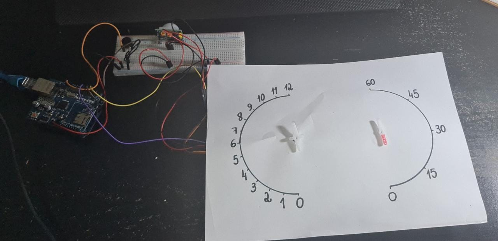

<h1 align="center"> Relógio Inteligente - IClock </h1>
<H3 align="center"> MENU DE ACESSOS </h3>
<H5 align="center"> Relógio que informa 
para o usuário a hora que foi detectado o movimento através de seu Sensor PIR acoplado 
na protoboard. Ao informar a hora, os servos motores, reiniciam o seu 
movimento do ponto 0 até que chegue uma nova detecção de movimento, informando 
novamente a hora para o usuário.</h5>

<a href="https://github.com/gabs-iii/IClock/blob/main/C%C3%B3digo.txt"> Código do Projeto</a> •
<a href="https://github.com/gabs-iii/IClock/blob/main/Diagrama.png"> Tinkercad</a> •
<a href="https://github.com/gabs-iii/IClock/blob/main/Fluxograma_1.png"> Fluxograma </a>•
<a href="https://github.com/gabs-iii/IClock/blob/main/Trabalho_Objetos_Inteligentes_Conectados.pdf"> Documentação (Especifícações, Materiais Utilizados e etc...) </a>•
<a href="https://www.youtube.com/watch?v=gqFMDKGjRvU"> Vídeo de Apresentação</a>  

 <ul>
  

  
    
    
 
 Gabriela Fonseca Paradela - 31910701 /
     Guilherme Iglesias Alonso - 32086326
  

